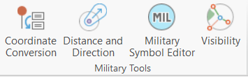

# military-tools-desktop-addins

Military Tools for ArcGIS is a collection of mission-focused enhancements to simplify defense and intelligence workflows in ArcGIS. The Military Tools for ArcGIS Desktop Add-ins repository combines several related mission-focused ArcGIS addins for defense and intelligence (see [Resources](#resources) section) as a single installable Add-in toolbar for ArcMap and ArcGIS Pro.



## Features

* ArcMap Toolbar and ArcGIS Pro Tab for the set of Military Tools for ArcGIS
	* [Coordinate Conversion](https://github.com/Esri/coordinate-conversion-addin-dotnet)
	* [Distance and Direction](https://github.com/Esri/distance-direction-addin-dotnet)
	* [Military Symbol Editor](https://github.com/Esri/military-symbol-editor-addin-wpf) (ArcGIS Pro Only)
	* [Visibility](https://github.com/Esri/visibility-addin-dotnet)
* Addin for ArcMap 10.3.1+
* Addin for ArcGIS Pro 2.1+ 

## Sections

* [Requirements](#requirements)
* [Instructions](#instructions)
* [Resources](#resources)
* [Issues](#issues)
* [Contributing](#contributing)
* [Licensing](#licensing)

## Requirements

### Build Requirements 

* Visual Studio 2015
    * Important Note: Visual Studio 2013 is required if building on ArcGIS 10.3.1
* ArcGIS for Desktop 
	* ArcMap 10.3.1+
	* ArcGIS Pro 2.1+
* ArcGIS Desktop SDK for .NET 10.3.1+
	* [ArcGIS Desktop for .NET Requirements](https://desktop.arcgis.com/en/desktop/latest/get-started/system-requirements/arcobjects-sdk-system-requirements.htm)
* [ArcGIS Pro SDK](http://pro.arcgis.com/en/pro-app/sdk/) 2.0+

### Run Requirements

* ArcGIS for Desktop 
	* ArcMap 10.3.1+
	* ArcGIS Pro 2.1+

## Instructions

### Build Instructions

#### Obtain the Dependent Repositories

* Clone this repository
* Clone each of the following component repositories *to the same folder location* 
	* [coordinate-conversion-addin-dotnet](https://github.com/Esri/coordinate-conversion-addin-dotnet)
	* [distance-direction-addin-dotnet](https://github.com/Esri/distance-direction-addin-dotnet)
	* [military-symbol-editor-addin-wpf](https://github.com/Esri/military-symbol-editor-addin-wpf)
	* [visibility-addin-dotnet](https://github.com/Esri/visibility-addin-dotnet)
* Your local folder structure should now look like:

```
{Github Clone Location}
+---military-tools-desktop-addins
+---coordinate-conversion-addin-dotnet
+---distance-direction-addin-dotnet
+---military-symbol-editor-addin-wpf
+---military-tools-geoprocessing-toolbox
+---visibility-addin-dotnet
```

**IMPORTANT NOTE: Because of file name length limitations in Visual Studio, the length of the folder name of {Github Clone Location} should not exceed 80 characters**

* A clone [script has been provided](./source/Utilities/CloneDependentRepos.bat) to automate the cloning of these repos. To use:
	* Open a Git shell/command prompt 
	* `cd military-tools-desktop-addins\source\Utilities`
	* `CloneDependentRepos.bat`

#### Building

* To Build Using Visual Studio
	* Open and build solution files:
	* `{Github Clone Location}\military-tools-desktop-addins\source\MilitaryToolsForArcGISPro\MilitaryToolsForArcGISPro.sln`
	* `{Github Clone Location}\military-tools-desktop-addins\source\MilitaryToolsForArcMap\MilitaryToolsForArcMap.sln`
* To use MSBuild to build the solution
	* Open a Visual Studio Command Prompt: Start Menu | Visual Studio | Visual Studio Tools | Developer Command Prompt
	* ArcGIS Pro Add-in
		* ``` cd military-tools-desktop-addins\source\MilitaryToolsForArcGISPro ```
		* ``` msbuild MilitaryToolsForArcGISPro.sln /property:Configuration=Release ```
	* ArcMap Add-in
		* ``` cd military-tools-desktop-addins\source\MilitaryToolsForArcMap ```
		* ``` msbuild MilitaryToolsForArcMap.sln /property:Configuration=Release ```

#### Running

* ArcGIS Pro Add-in
	* Double-click to install the build add-in file: 
	* `military-tools-desktop-addins\source\MilitaryToolsForArcGISPro\bin\Release\MilitaryToolsforArcGISPro.esriAddinX`
	* Run ArcGIS Pro and use the tools on the Military Tools tab
* ArcMap Add-in
	* Double-click to install the build add-in file: 
	* `military-tools-desktop-addins\source\MilitaryToolsForArcMap\bin\Release\MilitaryToolsforArcMap.esriAddIn`
	* Run ArcMap and enable the Military Tools toolbar

#### More Information

For more information, please consult the [wiki](https://github.com/Esri/military-tools-desktop-addins/wiki) or [landing page](https://esri.github.io/military-tools-desktop-addins).

## Resources

* [Military Tools for ArcGIS](http://solutions.arcgis.com/defense/help/military-tools/)
* [ArcGIS for Defense Downloads](http://appsforms.esri.com/products/download/#ArcGIS_for_Defense)
* [ArcGIS Solutions Website](http://solutions.arcgis.com/military/)
* [ArcGIS 10.X Help](http://resources.arcgis.com/en/help/)
* [ArcGIS Blog](http://blogs.esri.com/esri/arcgis/)
* [ArcGIS Pro Help](http://pro.arcgis.com/en/pro-app/)
* [@EsriDefense](http://twitter.com/EsriDefense)

### Related repositories:

* [coordinate-conversion-addin-dotnet](https://github.com/Esri/coordinate-conversion-addin-dotnet)
* [distance-direction-addin-dotnet](https://github.com/Esri/distance-direction-addin-dotnet)
* [military-symbol-editor-addin-wpf](https://github.com/Esri/military-symbol-editor-addin-wpf)
* [military-tools-geoprocessing-toolbox](https://github.com/Esri/military-tools-geoprocessing-toolbox)
* [solutions-webappbuilder-widgets](https://github.com/Esri/solutions-webappbuilder-widgets)
* [visibility-addin-dotnet](https://github.com/Esri/visibility-addin-dotnet)

## Issues

Find a bug or want to request a new feature?  Please let us know by submitting an [issue](https://github.com/Esri/military-tools-desktop-addins/issues).

## Contributing

Esri welcomes contributions from anyone and everyone. Please see our [guidelines for contributing](https://github.com/esri/contributing).

### Repository Points of Contact

##### Repository Owner: [Kevin](https://github.com/kgonzago)

* Review/Merge Pull Requests
* Creates Releases and Tags
* Manages Milestones
* Manages and Assigns Issues

##### Secondary: [Lorraine](https://github.com/lfunkhouser)

* Backup when the Owner is unavailable

## Licensing

Copyright 2016-2017 Esri

Licensed under the Apache License, Version 2.0 (the "License");
you may not use this file except in compliance with the License.
You may obtain a copy of the License at

   http://www.apache.org/licenses/LICENSE-2.0

Unless required by applicable law or agreed to in writing, software
distributed under the License is distributed on an "AS IS" BASIS,
WITHOUT WARRANTIES OR CONDITIONS OF ANY KIND, either express or implied.
See the License for the specific language governing permissions and
limitations under the License.

A copy of the license is available in the repository's [LICENSE](./LICENSE) file.

